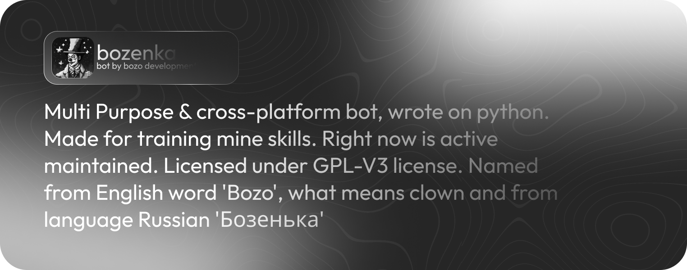

[Telegram Channel](https://t.me/bozodevelopment/)

<h2>Telegram Instance</h2>

### Features of Telegram instance

- [ ] Group
  - [ ] Administration
    - [x] Ban & Unban commands
    - [x] Mute & Unmute commands
    - [x] Pin & Unpin & Unpin all commands
    - [ ] Bad words & Spam filter
    - [ ] Setup command (Going to release)
    - [x] Welcome message to administrators after adding bot to chat.
    - [x] Work with inline keyboard
  - [x] Work with telegram topics
    - [x] Close & Open Topics
    - [x] Hide general topic
    - [x] Rename topics
    - [x] Work with inline keyboard
  - [x] Users
    - [x] Show information about chat (/info)
    - [x] Welcome messages
    - [x] Generating invites
    - [x] Start command menu (/start)
- [ ] Fun
  - [ ] GPT based text generation
    - [x] Gpt4All
    - [x] Gpt4Free
    - [ ] RWKV
    - [ ] H20
    - [x] Work with inline keyboard
    - [ ] Using tutorial.
    - [x] Threads and Topic of dialog support (Already by new aiogram)
  - [ ] Image generation
    - [ ] Using tutorial 
    - [ ] Inline generation
    - [x] Imagine command + inline keyboard support
- [x] Code
  - [x] Logging support
  - [x] Features descriptions
  - [x] Custom Filters
  - [x] Middlewares
  - [x] Database

### This part of project made with

-  [Aiogram python library](https://github.com/aiogram/aiogram) and with their community support.
-  [GPT4Free](https://github.com/xtekky/gpt4free), [Gpt4All](https://github.com/nomic-ai/gpt4all), [SqlAlchemy](https://github.com/sqlalchemy/sqlalchemy/) python libraries
- With our love & your support <3

