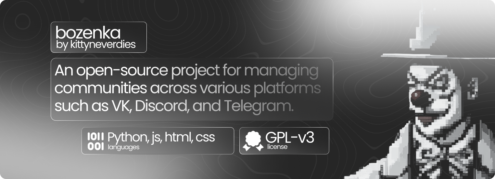

 

[Telegram Channel](https://t.me/bozodevelopment/) | [Website](https://kittyneverdies.github.io/Bozenka/) (UI  is outdated)

Current state - 79% of basic realisation

> [!IMPORTANT]
> The Bozenka project has been changed it's goal to create solution for managing communities, automating moderation, and allowing users to interact with LLM and other AI models, which should be safe, transparent & open to community, easy to edit and understand, and scalable enough to add new features and maintain them in the future

> [!IMPORTANT]
> Bozenka project is currently under active development. Some features are not yet functional. We do not recommend deploying Bozenka on your server at this time until the prototype-zero release. \
> **For developers:** Instead of PostgreSQL, we are currently using SQLite3 in the backend for faster development and testing.

> [!WARNING]  
> We are currently migrating from our old codebase to a new one. Current results isn't release & bozenka is still in development. To find out what updates are happening with Bozenka, subscribe to the Bozo development channel on Telegram. 

### Workflow

Currently, we are focusing on separating the frontend part of the project, which includes React and Material-UI JavaScript libraries, from the backend part, which comprises Django, Aiogram, PyCord, and VKBottle Python libraries.\
Our objective is to develop an API that can be utilized to build a native client using React Native (cross-platform) or C# with .NET Framework on Windows.\
For a better understanding of our workflow, please refer to the following overview, which was taken from our Telegram channel.

<figure>
    
    <figcaption>Workflow of new bozenka project in Russian language. Taken from telegram channel.</figcaption>
</figure>

### Current State of Development
- [Frontend](bozenka-frontend/):
    - [x] Home (Needs improvements) \
        I think its requires some redesign with visualisation of bozenka works with 3d elements. Current redesign is nice, but still requires imnprovements
    - [x] Communities search (Need improvements) \
        Required toggable filters menu, fixes of range sliders & search hints. But main functionality is done.
    - [x] Community \
        Already done main things like tab system, mobile support & information with tags and links. It's required to improve current charts.
    - [x] Registration & Login \
        Should be on one page (for Users eye, not means it should be on one adress) where user can just toggle with animation register and login. Anyway, it's has been done, but need some changes.
    - [x] Dashboard \
        Still searching for ideas... Currently in developement. 
        - [x] Homepage \
            Main start page, if you are already logged in.
        - [x] Add, edit & create comunity \
            Add already exists community from social platforms or create new one on Bozenka platform. Will need some resturcture
        - [x] Manage account \
            Manage account (change password, email and etc)
        - [ ] Connection with Backend (Started)
            - [x] Basic Api Calls \
                Basic implementation of calls to api, to get true information, not place holders.
                - [x] Get basic information \
                    Right now we can get information about communities easily.
                - [x] Authorization \
                    Registration and getting into account is working properly. There still can be some improvements.
                - [ ] Features managment
            - [ ] Caching \
                Use Redis storage for caching information, what we get.

            
- [Backend](bozenka-backend/):
    - [x] Database Models (Refactors in future) \
        Has been writen first after creation of new bozenka project
    - [x] Basic sturcture
        - [x] Features class structure \
        Making development easy to understand for others and easy to maintain for me
        - [x] Auto registration of features \
        Register handlers for VK, Telegram , Discord from features with filters (BETA)
    - [x] Paralel tasks
      - [x] Telegram bot \
      Using asyncio tasks, dispatcher launches and all handlers are working.
      - [x] Discord bot \
          Discord bot is launching, registering commands, everything working without exceptions
      - [x] Vk bot \
          Worst development expirence, but it's also works well by some not good techincs.
    - [ ] Rest API from Django
        - [ ] Registration & Authorization (Beta) \
            <strike>Probably using OAuth or something other.</strike> Using JWT to register Users and support authorization, right now only in beta test, for understanding it work.
          - [x] Basic authorization
            Using JWT to get authorization token and refresh token.
          - [ ] Mail verification. \
            Probably just an integrated SMTP server with ability to verification. Already in work
          - [ ] Social networks & Messengers integration by Oauth? \
            I don't fully understand, how to do that. (Release in future.)
        - [x] Give infromation about communities\
            By requests from frontend to us
        - [x] Ability to update basic information \
            We can do it right now
        - [x] ASGI with paralel part of Backend \
            Using ASGI to work in paralel with bots instances on platforms
    - [ ] Write features for Bozenka
        - [ ] Work on Statistics workflow
        - [ ] Work on Frontend and Backend connection with information about features.
  
- Guidelines (Documentation)
    - [x] How does bozenka's structure work?
    - [ ] Bozenka design phylosophy (P.S if it exists)
    - [ ] How to write your own feature?
    - [ ] How to help in development?
    - [ ] Commiting your changes to Bozenka.