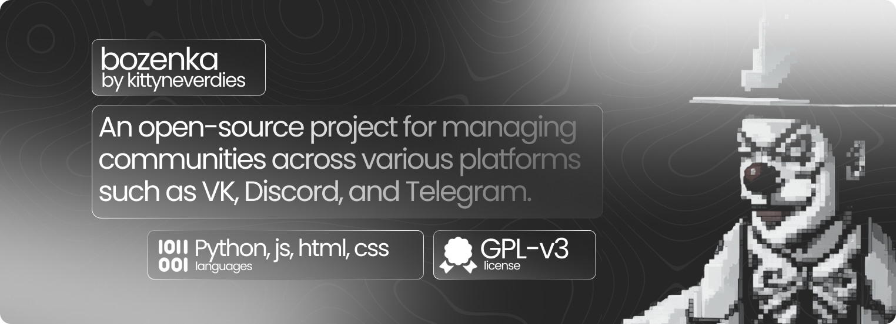

 

[Telegram Channel](https://t.me/bozodevelopment/) | [Website](kittyneverdies.github.io/Bozenka/) (UI outdated)

> [!IMPORTANT]
> Bozenka project has been changed it's goal to create solution for managing communities, automating moderation, and allowing users to interact with LLM and other AI models, which should be safe, transparent & open to community, easy to edit and understand, and scalable enough to add new features and maintain them in the future

> [!WARNING]  
> We are currently migrating from our old codebase to a new one. Current results isn't release & bozenka is still in development. To find out what updates are happening with Bozenka, subscribe to the Bozo development channel on Telegram. 

### Workflow

Currently, we are focusing on separating the frontend part of the project, which includes React and Material-UI JavaScript libraries, from the backend part, which comprises Django, Aiogram, PyCord, and VKBottle Python libraries.\
Our objective is to develop an API that can be utilized to build a native client using React Native (cross-platform) or C# with .NET Framework on Windows.\
For a better understanding of our workflow, please refer to the following overview, which was taken from our Telegram channel.

<figure>
    
    <figcaption>Workflow of new bozenka project in Russian language. Taken from telegram channel.</figcaption>
</figure>

### Current State of Development
- Frontend:
    - [x] Home (Needs improvements) \
        I think its requires some redesign with visualisation of bozenka works with 3d elements
    - [x] Communities search (Need improvements) \
        Required toggable filters menu, fixes of range sliders & search hints.
    - [ ] Community \
        Already done main things like tab system, mobile support & information with tags and links. It's required to add normal charts to it with grid of posts
    - [x] Registration & Login \
        Should be on one page (for Users eye, not means it should be on one adress) where user can just toggle with animation register and login. Anyway, it's has been done, but need some changes.
    - [ ] Dashboard \
        Still searching for ideas...
- Backend:
    - [x] Database Models (Refactors in future) \
        Has been writen first after creation of new bozenka project
    - [ ] Rest API from Django
        - [ ] Registration & Authorization
        - [ ] Give infromation about communities & search
    - [x] Telegram bot (from old base) \
        Old main branch (everything was starting from small one python file...)
    - [ ] Discord bot \
        Going to use PyCord python library to do it
    - [ ] Vk bot \
        Going to use VkBottle python library for it 
- Guidelines
    - [ ] How does bozenka's structure work?
    - [ ] Bozenka design phylosophy (P.S if it exists)
    - [ ] How to write your own feature?
    - [ ] How to help in development?
    - [ ] Commiting your changes to Bozenka.