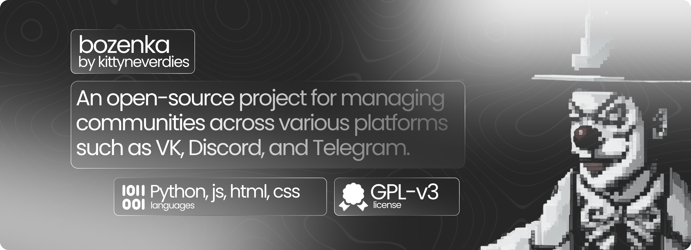
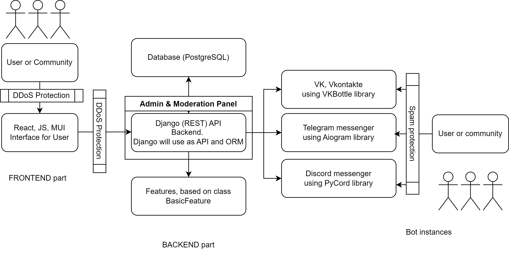

# Quick start

<figure><figcaption>
Bozenka card.
</figcaption></figure>

As you know, there are many different communities on various social platforms and networks. The main problem in this situation is that there is no project or utility that allows you to manage or expand communities from one platform to another. Bozenka solves that problem as open-source project.

### Workflow

Currently, the project is divided into two parts: the frontend and the backend. The frontend is built using React and Material-UI JavaScript libraries, while the backend is constructed using Django, Aiogram, PyCord, and VKBottle Python libraries.

The frontend should send requests to the backend for information, and the backend should send the information back to the frontend. We want the backend to work with different platforms simultaneously, including Telegram, Vkontakte, and Discord (using Aiogram, VKBottle, and Discord, respectively).

Our goal is to create an API that can be used to build a native client using React Native for cross-platform development or C# with the.NET Framework on indows.&#x20;

<figure><figcaption>
Illustration of bozenka workflow
</figcaption></figure>

